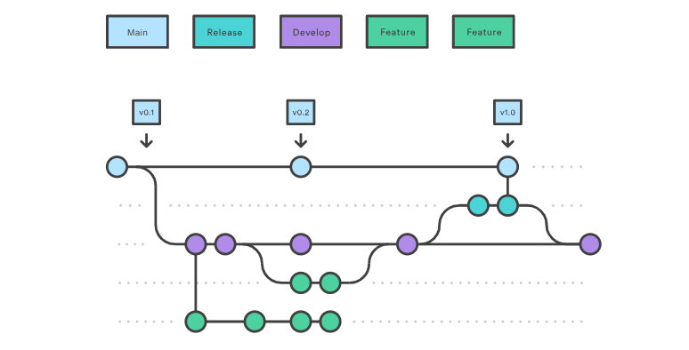
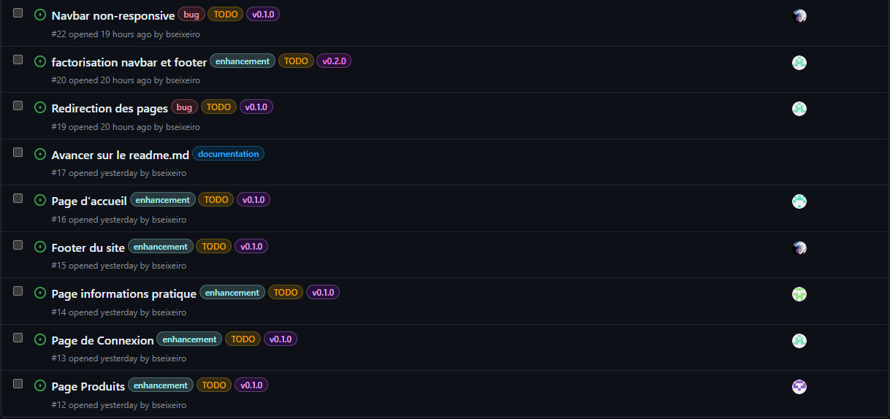

# TP TechStore

## Phase 1: Initialisation et Planification

Après avoir créer un dépôts GitHub vide et un token. Les autres membre du groupe le forke et le recupère en local

```sh
$ git remote add origin git@github.com:bseixeiro/TechStore.git

$ git clone git@github.com:bseixeiro/TechStore.git
```

On rajoute le readme.md :
```sh
$ touch readme.md
```

on l'ajoute et on le commit :
```sh
$ git add .
$ git commit -m "init : readme.md added"
```

et on le push sur le repos en github :
```sh
$ git push -u origin main
```
et on lui mets un tag de v0:
```sh
$ git tag -a v0.0 -m "Initialisation du projet" 
```
on créé une branche de développement (develop), on bascule dessus, on commit les changements et on le push dans le repos github :

```sh
$ git checkout -b develop

$ git add .
$ git commit -m "readme.md updated"

$ git push -u origin develop
```

Petit problème lors de ce push, un merge de la branche de dev a été fait sur la main. On a donc du resynchroniser les deux branches avant de continuer.

Pour que tout le monde est accès à la branche de developpement, on doit récuperer les branches du repos principale:

```sh
$ git remote add upstream git@github.com:bseixeiro/TechStore.git

$ git pull upstream develop
```

**Questions :**

 - Pour l'organisation des branches, nous allons suivre la méthode de Git Flow, notre branche main corresponds au version de prod de notre site, la branche develop de référence dans l'avancement du projet, c'est ici que l'on ajoute les features une fois terminées. Pour chaque features on créé une nouvelle branche pour pouvoir travailler en parrallèle et une fois finit on merge sur la develop. Avant de merge la branche develop sur la main on fais une branche release/(version), où l'on effectue les phases de test et correction de bug pour la version.Si jamais on a un problème en prod on créé une branche hotfix basé sur la main où l'on fais les corrections necessaires avant de remerge sur la main.

*src => https://www.atlassian.com/fr/git/tutorials/comparing-workflows/gitflow-workflow*




 - On se sert essentiellement de ce que nous propose github pour suivre l'avancement du projet en créant des issues avec des tags.



#### Phase 2: Développement des Fonctionnalités

1. On se créé localement une branche Feature/<tâche> et bascule pour travailler dessus :
```sh
$ git chekout -b Feature/Product 
```

**Questions :**

  - Chacun fait des commits réguliers sur ses branches de features en nommant clairement ce qui a été fait pour ce commit.


  Une fois une features terminée, on la merge sur la branche develop en gardant la trace de la branche features.


  On applique le même principe pour la branche release. 


  Pour la branche main on nomme le commit avec le nom de la version du projet.

